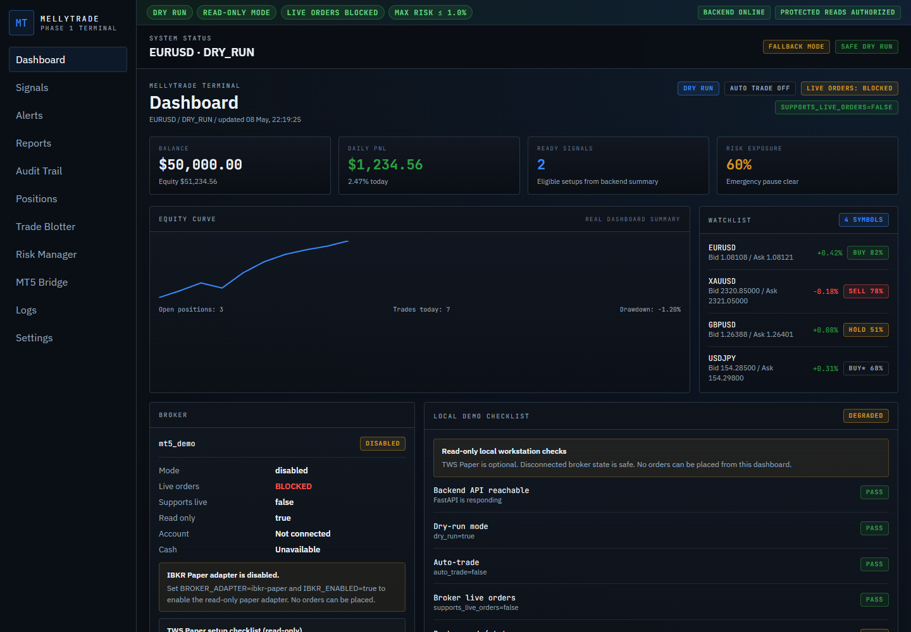

# MellyTrade / Alpha Data Scraper AI


MellyTrade is an AI-assisted trading workstation designed around safe signal analysis, broker abstraction, dry-run execution, and dashboard-based monitoring.

The project combines a FastAPI backend, React/TypeScript dashboard, broker adapter architecture, IBKR Paper Trading support, MT5-oriented integration paths, execution and risk controls, and local tooling for safe development and testing.

> Current status: local workstation and paper-trading infrastructure. Live trading is intentionally disabled by default.

## For Recruiters

MellyTrade is a portfolio project that demonstrates how I design AI-assisted, safety-first fintech tooling: a FastAPI backend, React/TypeScript terminal UI, read-only broker/status surfaces, risk guardrails, audit/event views, paper sandbox previews, and local validation scripts. It is intentionally **read-only and dry-run**: no live trading, no broker execution, no order routes, no order buttons, and no connect-live UX.

What this proves technically: API design with typed schemas, frontend dashboard/state handling, safety-first product thinking, local runbooks, pytest-backed safety checks, Git/GitHub workflow, and supervised AI-assisted engineering with human review. Stack: Python, FastAPI, Pydantic, React, TypeScript, Vite, pytest, Git, PowerShell, Docker basics, Claude Code, OpenAI Codex, GitHub Copilot, and Ollama/LM Studio.

Review in 3 minutes:

1. Read the safety posture below and run `py -3.11 scripts/validate_safety_config.py`.
2. Open the recruiter case study: [docs/career/recruiter_case_study.md](docs/career/recruiter_case_study.md).
3. Check the demo evidence plan: [docs/demo/recruiter_screenshot_checklist.md](docs/demo/recruiter_screenshot_checklist.md) and [docs/demo/recruiter_loom_demo_script.md](docs/demo/recruiter_loom_demo_script.md).
4. Review CV positioning notes: [docs/career/cv_positioning_notes.md](docs/career/cv_positioning_notes.md).

## MellyTrade Terminal Demo

MellyTrade is a safety-first, read-only AI trading terminal prototype focused on explainable signals, paper sandbox previews, auditability, and strict execution guardrails.

What the current demo shows:

- Red-black institutional terminal UI
- AI Workspace
- Paper Sandbox Preview
- Paper Sandbox Activity/Audit Rail
- Read-only broker/safety posture
- GET-only local smoke checks

Safety posture:

```text
autotrade=false
dry_run=true
read_only=true
live_orders_blocked=true
max risk <=1%
no order/buy/sell/execute controls
no live trading UX
```

Demo docs:

- [docs/demo/demo_002_screenshot_pack.md](docs/demo/demo_002_screenshot_pack.md)
- [docs/demo/demo_002_screenshot_inventory.md](docs/demo/demo_002_screenshot_inventory.md)
- [docs/demo/demo_002_portfolio_story.md](docs/demo/demo_002_portfolio_story.md)
- [docs/demo/demo_004_showcase_copy_pack.md](docs/demo/demo_004_showcase_copy_pack.md)
- [docs/demo/demo_004_github_readme_section.md](docs/demo/demo_004_github_readme_section.md)
- [docs/demo/demo_004_cv_portfolio_bullets.md](docs/demo/demo_004_cv_portfolio_bullets.md)
- [DEMO-008 — Post-SIG-004B Signal Quality UI Evidence](docs/demo/demo_008_post_sig_004b_signal_quality_evidence.md)
- [iPad PWA Paper Run Preview Showcase](docs/showcase/ipad_pwa_paper_run_preview.md)
- [DEMO-010 — Portfolio / LinkedIn copy pack](docs/demo/demo_010_portfolio_linkedin_copy_pack.md)

## iPad PWA Paper Run Preview Showcase

MellyTrade now includes a read-only Paper Run Preview flow that runs safely as an iPad-installable PWA.

What it demonstrates:

- paper trading preview
- risk-gated decision preview
- deterministic run preview
- GET-only backend endpoints
- frontend Paper Run Preview panel
- iPad / Safari PWA support
- safety-first design

Safe architecture:

- frontend calls `GET /paper/run/preview`
- no `POST` / `PUT` / `PATCH` / `DELETE` trading mutation endpoints
- no broker execution
- no MT5 / IBKR account data
- no real orders
- backend stayed loopback-only during iPad LAN smoke
- frontend LAN / Tailscale access was used only for local testing

Safety posture:

- `READ ONLY`
- `DRY RUN`
- `LIVE ORDERS BLOCKED`
- `HUMAN REVIEW REQUIRED`
- `EXECUTION OFF`

Evidence:

- [docs/demo/demo_009_ipad_pwa_smoke_evidence.md](docs/demo/demo_009_ipad_pwa_smoke_evidence.md)
- [docs/demo/demo_009_ipad_pwa_screenshot_checklist.md](docs/demo/demo_009_ipad_pwa_screenshot_checklist.md)
- [docs/devices/ipad_pwa_smoke_test.md](docs/devices/ipad_pwa_smoke_test.md)

Local verification:

```powershell
py -3.11 scripts/validate_safety_config.py

py -3.11 -m pytest tests/app/test_openapi_forbidden_paths.py tests/app/test_safety_invariants.py -q

powershell -ExecutionPolicy Bypass -File scripts/demo_paper_sandbox_readonly_smoke.ps1 -BackendBaseUrl http://127.0.0.1:8001 -FrontendBaseUrl http://127.0.0.1:5173
```

The Playwright e2e suite also runs in GitHub Actions CI on every PR to main ([`.github/workflows/frontend-e2e.yml`](.github/workflows/frontend-e2e.yml)) — 54 tests across iPad and mobile viewports, no backend required.

Screenshots were captured locally outside the repository and are intentionally not committed as binary assets.

## Beta rollout documentation

For source-only beta operations, start here:

- [Beta Docs Index](docs/beta/README.md)
- [Beta Rollout Operator Command Center](docs/beta/beta_rollout_operator_command_center.md)
- [Beta Rollout Operator Master Checklist](docs/qa/beta_rollout_operator_master_checklist.md)

Safety note:

The beta rollout is source-only, read-only, dry-run-only, and manual. It does not approve live trading, broker execution, investment advice, or generated artifact releases.

### Screenshots

| View | Screenshot |
|---|---|
| Terminal overview | [terminal-overview.png](docs/assets/screenshots/closed-beta/terminal-overview.png) |
| AI scanner workspace | [ai-scanner-workspace.png](docs/assets/screenshots/closed-beta/ai-scanner-workspace.png) |
| Risk manager read-only | [risk-manager-readonly.png](docs/assets/screenshots/closed-beta/risk-manager-readonly.png) |
| Audit event rail | [audit-event-rail.png](docs/assets/screenshots/closed-beta/audit-event-rail.png) |
| Broker safe-disconnected | [broker-status-safe-disconnected.png](docs/assets/screenshots/closed-beta/broker-status-safe-disconnected.png) |

Related docs:

- [Closed beta disclaimer](docs/product/closed_beta_disclaimer.md)
- [Closed beta limitations](docs/product/closed_beta_limitations.md)
- [Browser UI smoke checklist](docs/qa/browser_ui_smoke_checklist.md)

---

## MellyTrade Terminal V1



A **read-only, dry-run AI trading terminal prototype** focused on market
context, signal observability, auditability, risk posture, and a daily
plan preview. The terminal is built to *explain what the system is doing
and why it is safe* — not to execute trades.

> **THIS IS A READ-ONLY TOOL. NO LIVE TRADING OCCURS. NO ORDERS ARE PLACED.**

The Terminal V1 surface is GET-only and structurally incapable of placing
an order. Its safety posture is enforced both by code shape (Pydantic
schemas without execution-shaped fields, no mutating frontend helpers in
read-only pages) and by an executable test suite that fails the build if
the posture ever drifts.

## Terminal V1 Highlights

- **Polished read-only dashboard UX states.** Shared `<ResourceState>`
  shell renders consistent loading, empty, degraded, and
  *last-updated-at* states across every polling card.
- **Read-only audit / event feed with safety notes.** Each event carries
  `id`, `timestamp`, `type`, `severity`, `read_only=true`, and a
  one-sentence `safety_note` explaining the safety implication.
- **Daily Trading Plan Preview.** Static, display-only card with
  instrument bias, setup quality, risk tier, no-trade conditions, and
  optional setup-area / notes. No buttons, no clickable rows, no
  BUY/SELL affordances. The schema deliberately omits any
  execution-shaped field (quantity, lot, sl, tp, order id).
- **Safety regression tests.** A 39-assertion pytest file codifies the
  read-only / dry-run contract as enforceable invariants — if a future
  change adds a mutating route, an order-placement function call, or
  raises the per-trade risk cap, the build breaks.
- **Local demo runbook.** A reviewer-ready walkthrough that covers
  prerequisites, startup commands, smoke-test endpoints, and the full
  list of capabilities that are *intentionally* out of scope.

## Safety-First Posture

Terminal V1 enforces the following invariants. Each one has a
corresponding test that fails the build if the posture drifts.

| Invariant | Value | Where it is enforced |
|---|---|---|
| `autotrade.enabled` | `false` | `config.json` + safety regression tests |
| `autotrade.dry_run` | `true` | `config.json` + safety regression tests |
| `read_only` | `true` | every emitted audit event, `/api/risk/config`, schema defaults |
| `max_risk_per_trade` | `≤ 1.0%` | `/api/risk/config`, asserted in tests |
| Live orders | **blocked** | `live_orders_blocked` audit event always emitted |
| Execution routes | **none in Terminal V1** | route-inventory test fails on any non-GET method under the Terminal V1 prefixes |
| Order buttons | **none** | static text-scan test fails on `placeOrder(`, `executeOrder(`, button text like "Place Order" / "Execute Trade" / "Submit Order" |
| Broker write paths | **none in Terminal V1** | `/broker/dry-run-report` is on a small admin allowlist and is dry-run only |
| Secrets required for the demo | **none** | the terminal does not authenticate against any live broker |

## Executable Safety Spec

Three pytest files act as the executable safety contract for Terminal V1:

- [`tests/app/test_safety_invariants.py`](tests/app/test_safety_invariants.py)
  — 39 assertions covering route inventory, `config.json` posture, live
  `/risk/config` values, audit-feed shape, and a static frontend scan
  for mutating helpers and order-button text.
- [`tests/app/test_trading_plan.py`](tests/app/test_trading_plan.py)
  — 10 assertions locking the Daily Trading Plan response shape, the
  read-only label, the `≤ 1%` risk cap, the absence of execution-shaped
  fields, and a 405 proof for POST/PUT/DELETE/PATCH against the route.
- [`tests/app/test_audit_events.py`](tests/app/test_audit_events.py)
  — Existing route and audit coverage that this sprint extends.

These tests are deliberately small and fast (the full
`tests/app/` suite runs in under a second). They are intended to be
treated as a regression net — if any of them fails, something
safety-relevant has changed.

## MERGE #100 — Read-Only AI Operations Layer

The latest milestone (MERGE #100) layers an observability and
explainability surface on top of the existing read-only terminal.
Nothing in this milestone changes the safety posture — every
new endpoint is `GET`, every new UI control is display-only.

### Observability architecture

```
External signals → FastAPI (GET-only) ─┬─> Supabase (RLS deny-all, service_role only)
                                       └─> In-memory seed fixtures (degraded fallback)
                                       ↓
                  React frontend (poll-only) — usePollingResource → apiGet
                                       ↓
                  Stale-data detector (90s threshold, 15s recheck, pure UI)
```

Full diagram + invariants:
[docs/architecture/milestone_100_readonly_ai_ops.md](docs/architecture/milestone_100_readonly_ai_ops.md).

### Read-only guarantees (re-affirmed by MERGE #100)

- All new endpoints are `GET`. No `POST`/`PUT`/`PATCH`/`DELETE` was
  added to the signal surfaces.
- Date-range filters on `/api/signals/decisions` accept ISO 8601
  bounds and are applied server-side via Supabase `.gte()`/`.lte()`;
  the seed-fallback path applies the same window in Python so
  behaviour is identical from the caller's perspective.
- The Supabase service-role key is **never** exposed to the browser.
  Every Supabase read goes `frontend → FastAPI → service_role → DB`.

### AI reasoning layer

The signal drawer now hosts a structured, collapsible
`SignalReasoningPanel` (DATA-002) covering: *why this signal*,
confidence breakdown vs the 70% review threshold, *why blocked*
when applicable, the failed/passed risk gates, an explicit
*human review required* framing, and an optional Claude
validation block. Four safety badges (`DRY RUN ONLY`,
`READ ONLY`, `HUMAN REVIEW REQUIRED`, `RISK BLOCKED`) render
on every variant so a screenshot cannot be misread.

### Supabase audit pipeline

The `signal_decisions` table has RLS enabled with a deny-all
default (`supabase/migrations/20260516_signal_decisions_rls.sql`).
Frontend access is impossible without service_role; service_role is
never exposed to the browser; the FastAPI layer re-enforces every
safety field on read so a malicious or corrupted row cannot bypass
the posture.

### Safety model — verbatim contract

```
autotrade=false
dry_run=true
read_only=true
live_orders_blocked=true
max_risk_per_trade <= 0.01
no POST/PUT/PATCH/DELETE on the signal surface
no broker execution routes registered
no MT5 execution paths invoked
no service_role exposure to the browser
no order placement code path
no interactive trading controls
```

### Screenshots / Demo Walkthrough — MERGE #100

Screenshot evidence pack created in DEMO-002. Images are planned; the
capture runbook, checklist, and portfolio captions are ready.

| # | File | Purpose | Status |
|---|---|---|---|
| 01 | [`docs/assets/screenshots/01-terminal-ai-workspace.png`](docs/assets/screenshots/01-terminal-ai-workspace.png) | Full dashboard: safety banner, system status, equity curve, activity feed | planned |
| 02 | [`docs/assets/screenshots/02-signal-decision-history-filters.png`](docs/assets/screenshots/02-signal-decision-history-filters.png) | Decision History with 1H chip active, freshness label, filter controls | planned |
| 03 | [`docs/assets/screenshots/03-signal-reasoning-panel.png`](docs/assets/screenshots/03-signal-reasoning-panel.png) | AI Reasoning panel open — all four safety badges, confidence breakdown, risk gates | planned |
| 04 | [`docs/assets/screenshots/04-audit-feed-safety-events.png`](docs/assets/screenshots/04-audit-feed-safety-events.png) | Audit feed: `stale_data_warning`, `scanner_evaluated`, `risk_blocked` rows | planned |
| 05 | [`docs/assets/screenshots/05-supabase-status-and-stale-indicators.png`](docs/assets/screenshots/05-supabase-status-and-stale-indicators.png) | Decision History badges: `read-only`, `live data`/`seed data`, freshness label | planned |
| 06 | [`docs/assets/screenshots/06-broker-readonly-guardrails.png`](docs/assets/screenshots/06-broker-readonly-guardrails.png) | Risk/broker card: `dry_run=true`, `auto_trade=false`, guardrail values | planned |
| 07 | [`docs/assets/screenshots/07-demo-overview.png`](docs/assets/screenshots/07-demo-overview.png) | Full Signals page: Signal Review + Decision History + Lifecycle stacked | planned |

**Capture docs:**
- [Screenshot checklist](docs/demo/demo_screenshot_checklist.md) — per-screenshot requirements, viewport settings, redaction checklist
- [Capture runbook](docs/demo/demo_002_capture_runbook.md) — step-by-step capture guide with validation and safety notes
- [Demo walkthrough](docs/demo/professional_demo_walkthrough.md) — 8-minute scripted demo with screenshot capture flow
- [Architecture](docs/architecture/milestone_100_readonly_ai_ops.md) — component map, data flow, safety barriers

## Local Demo

Full reviewer walkthrough lives in
[`docs/demo/terminal_v1_local_demo.md`](docs/demo/terminal_v1_local_demo.md).
Quick smoke commands (each verified on this branch):

```powershell
# Targeted: safety regression net
py -3.11 -m pytest tests/app/test_safety_invariants.py -q

# Targeted: trading-plan tests
py -3.11 -m pytest tests/app/test_trading_plan.py -q

# Full local backend test suite
py -3.11 -m pytest tests/app/ -q

# Frontend type-check + production build
cd frontend
npm run build
```

Expected on this branch: 39 / 10 / 145 backend tests passing and a
clean Vite production build.

> The free Claude Code / local AI-worker setup that supports this work
> is tracked on a separate branch and is intentionally **not** linked
> from this README until the branches are merged.

## Read-only API Surface

The Terminal V1 endpoints are all GET-only. None of them mutate state,
place orders, or contact a real broker.

| Method | Path | Purpose |
|---|---|---|
| `GET` | `/api/health` | Liveness + safety posture summary |
| `GET` | `/api/terminal/events` | Read-only audit / event feed with `safety_note` |
| `GET` | `/api/terminal/trading-plan` | Daily Trading Plan Preview (static, display-only) |
| `GET` | `/api/risk/config` | Live risk gates: `dry_run`, `auto_trade`, `max_risk_per_trade` |
| `GET` | `/api/risk/status` | Current gate state given the account snapshot |
| `GET` | `/api/dashboard/summary` | Aggregate dashboard payload |

A 405 from any other HTTP method against `/api/terminal/trading-plan`
is part of the test contract — see `test_trading_plan_route_is_get_only`.

## What Is Intentionally Not Supported Yet

Each absence below is a design decision, not an oversight. Several are
enforced by `tests/app/test_safety_invariants.py`:

- **Live trading** — no Terminal V1 code path sends orders to a real broker.
- **Order placement** — no order ticket schema, no `POST /orders`, no `POST /trade`.
- **Order buttons** — no UI affordance for Place Order / Execute Trade / Submit Order / Send Live Order.
- **Broker write actions** — `POST /broker/dry-run-report` is allowlisted and dry-run only; it is not exposed in the Terminal V1 UI.
- **MT5 / IBKR live execution** — out of scope; the live execution boundary is upstream of Terminal V1 and intentionally not reachable from it.
- **Automatic trade execution** — `autotrade.enabled` is `false` in the committed `config.json` and the safety regression test fails if it ever flips to `true`.

Adding any of the above would require an explicit, separate change with
its own review and tests; on the current branch it would also break the
safety regression suite by design.

---

## Current Status

MellyTrade is currently in a safe local workstation and paper-trading phase.

Completed:
- FastAPI backend baseline
- React/TypeScript dashboard baseline
- IBKR Paper Adapter v1
- broker health and account endpoints
- read-only dashboard Broker card
- local Windows run scripts
- smoke testing workflow
- CI quality cleanup

In progress:
- MT5 bridge hardening
- execution v1 reconciliation
- broker heartbeat and reconnect monitoring
- dashboard polishing

Intentionally blocked:
- live trading
- real-money order execution
- automatic order placement without manual approval

## Core Features

- FastAPI control plane for health, dashboard, broker, signals, positions, logs, and risk views
- React and TypeScript dashboard for monitoring system state and broker connectivity
- IBKR Paper Adapter v1 with safe disconnected-state handling
- broker health, account, and dry-run reporting endpoints
- dry-run execution posture with defensive runtime defaults
- MT5 integration path preserved for future demo and bridge work
- risk and execution safety posture documented in code and docs
- local Windows helper scripts for backend startup, frontend startup, environment checks, and smoke tests
- pytest, mypy, flake8, and black quality workflow
- safety-first docs and local runbooks

## Architecture

```text
Signal / Analysis Layer
        ↓
Execution & Risk Layer
        ↓
Broker Adapter Interface
   ├── IBKR Paper Adapter
   ├── MT5 Demo / Bridge Path
   └── Future Broker Adapters
        ↓
FastAPI Control Plane
        ↓
React / TypeScript Dashboard
```

The dashboard is read-only for broker status, system visibility, and dry-run observability. It does not expose order-entry controls or live execution actions.

## Safety-First Design

MellyTrade uses defensive defaults:

- `autotrade.enabled = false`
- `dry_run = true`
- IBKR live orders are blocked
- `supports_live_orders = false` in IBKR Paper Adapter v1
- live broker execution is not exposed in the dashboard
- broker health is visible before any future execution path
- `.env.example` contains placeholders only
- local smoke tests verify dry-run behavior

This project is not financial advice and does not guarantee trading performance.

## Broker Support

| Broker / Adapter | Status | Notes |
|---|---:|---|
| IBKR Paper | Available | Safe paper and dry-run adapter with health and account endpoints |
| MT5 | In progress | Demo and integration path preserved |
| IBKR Live | Blocked | Future work only after manual approval mode and extended paper testing |
| XTB | Manual / not integrated | Not used as an automated adapter in the current architecture |

## Local Quick Start

Adjust paths to your local checkout if your repository lives elsewhere.

- Local demo checklist: [docs/LOCAL_DEMO_CHECKLIST.md](docs/LOCAL_DEMO_CHECKLIST.md)
- Local workstation release notes: [docs/RELEASE_NOTES_LOCAL_WORKSTATION.md](docs/RELEASE_NOTES_LOCAL_WORKSTATION.md)
- Portfolio case study: [docs/PORTFOLIO_CASE_STUDY_LOCAL_WORKSTATION.md](docs/PORTFOLIO_CASE_STUDY_LOCAL_WORKSTATION.md)

### Backend — IBKR Paper Mode

```powershell
cd C:\Users\highe\Desktop\alpha_data_scraper_ai-phase1-checkpoint
.\scripts\start_backend_ibkr_paper.ps1
```

### Frontend

```powershell
cd C:\Users\highe\Desktop\alpha_data_scraper_ai-phase1-checkpoint
.\scripts\start_frontend.ps1
```

Open:

```text
http://127.0.0.1:5173/
```

### Smoke Test

```powershell
cd C:\Users\highe\Desktop\alpha_data_scraper_ai-phase1-checkpoint
.\scripts\smoke_ibkr_paper.ps1
```

### Example Runner

```powershell
& "C:\AI\MellyTrade_Workspace\02_Repo\alpha_data_scraper_ai\.venv\Scripts\python.exe" example_runner.py --broker ibkr-paper --symbols AAPL MSFT
```

## Dashboard

The dashboard includes a read-only Broker card showing:

- broker adapter
- paper or live mode
- connection status
- account snapshot if available
- `Live orders: BLOCKED`
- `supports_live_orders = false`

When TWS or IBKR is not connected, the dashboard shows a safe disconnected paper state.

## Dashboard Preview

Screenshots can be added under:

```text
docs/assets/
```

Example:

```markdown

```

## Repository Structure

```text
app/                  FastAPI application, routes, schemas, services
brokers/              Broker adapter implementations and models
execution/            Execution and risk management layer
frontend/             React and TypeScript dashboard
scripts/              Local Windows helper scripts
docs/                 Runbooks and architecture notes
tests/                Backend and integration tests
mellytrade_v3/        MT5 and worker integration paths
```

## Roadmap

### Near-term
- Connect to a real TWS Paper session
- Add broker heartbeat and reconnect monitoring
- Improve broker and account dashboard cards
- Review and migrate execution v1 branch safely
- Add structured audit logs for broker dry-run reports

### Later
- Manual approval mode before any non-dry-run execution
- Optional IBKR paper bracket orders behind a disabled safety flag
- Persistent execution and audit storage
- Backtest-to-execution reconciliation
- Production deployment hardening

### Explicitly not enabled
- unattended live trading
- real-money order execution
- automatic order placement without manual approval

## Opis po polsku

MellyTrade to eksperymentalny terminal tradingowy i workstation do bezpiecznego testowania sygnałów, integracji brokerskich i przepływu dry-run.

Projekt łączy backend FastAPI, dashboard React/TypeScript, architekturę broker adapterów, wsparcie IBKR Paper, ścieżkę integracji MT5, mechanizmy kontroli ryzyka oraz lokalne skrypty do uruchamiania i testów.

Aktualny etap projektu to lokalne środowisko paper-trading i research. Handel na prawdziwych pieniądzach jest celowo zablokowany.

Najważniejsze założenia bezpieczeństwa:
- `autotrade.enabled=false`
- `dry_run=true`
- IBKR live orders są zablokowane
- dashboard nie udostępnia kontrolek do składania zleceń
- adapter IBKR Paper działa w trybie bezpiecznym i może pokazać stan disconnected, jeśli TWS nie jest uruchomione

## Disclaimer

This repository is for educational, research, and paper-trading development purposes only.

It does not provide financial advice, does not guarantee trading performance, and should not be used for unattended live trading. Live trading is intentionally disabled by default and should only be considered after extended paper testing, manual approval workflows, risk review, and legal and tax considerations.

## Suggested GitHub About

**Description**

AI-assisted trading workstation built with FastAPI, React, broker adapters, dry-run execution, IBKR Paper support, MT5 integration, risk controls, and dashboard monitoring.

**Topics**

`python`, `fastapi`, `react`, `typescript`, `trading`, `algorithmic-trading`, `paper-trading`, `ibkr`, `mt5`, `risk-management`, `dashboard`, `fintech`, `broker-adapter`, `dry-run`
