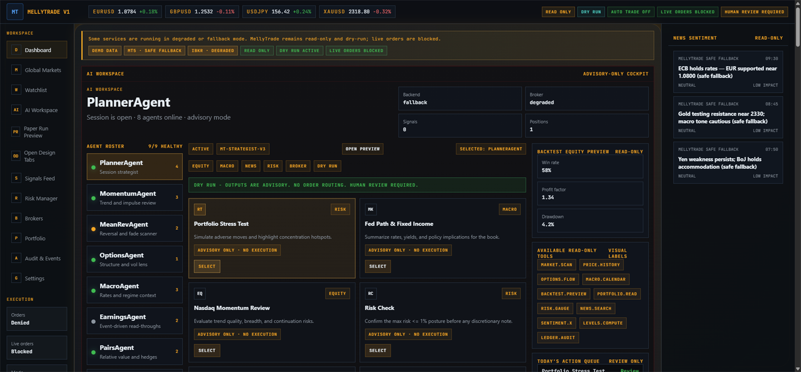
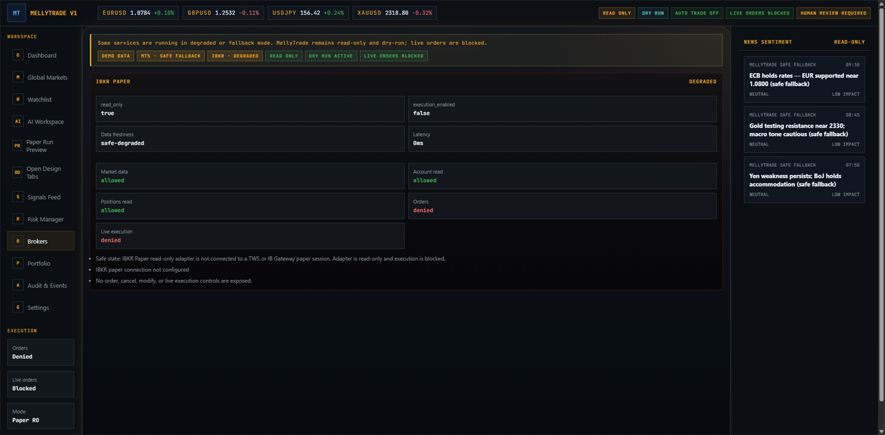
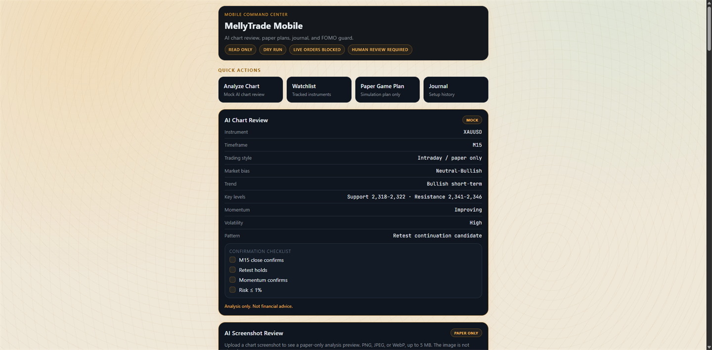
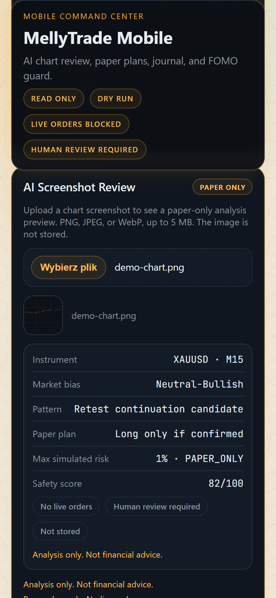

# MellyTrade

**Safety-first AI trading terminal and paper-risk workspace.**

MellyTrade is a read-only / dry-run fintech terminal demo for AI market analysis, portfolio/risk overview, broker status, paper-only previews, and audit-ready safety evidence — delivered as a web app, a mobile route, and a desktop (Tauri) shell on a shared FastAPI backend.

> Read-only · Dry-run · Paper-only · Live orders blocked · Human review required · No live execution

[](https://alpha-data-scraper-ai.vercel.app)
[](https://alpha-data-scraper-ai.vercel.app)
[](https://alpha-data-scraper-ai.vercel.app)
[](https://alpha-data-scraper-ai.vercel.app)
[](https://alpha-data-scraper-ai.vercel.app)
[](https://alpha-data-scraper-ai.vercel.app)

[](https://python.org)
[](https://fastapi.tiangolo.com)
[](https://react.dev)
[](https://typescriptlang.org)
[](https://tauri.app)
[](https://alpha-data-scraper-ai.vercel.app)

---

## Live Demo Matrix

No account, no login, no API keys required. Every surface is read-only and paper/simulation only.

| Surface | Link | What it proves |
|---|---|---|
| **Main app** | [alpha-data-scraper-ai.vercel.app](https://alpha-data-scraper-ai.vercel.app) | Hosted product entry point on Vercel |
| **Terminal** | [/terminal](https://alpha-data-scraper-ai.vercel.app/terminal) | Institutional dashboard: safety rail, market overview, signal workspace, Alpaca Paper status + order preview |
| **Mobile route** | [/mobile](https://alpha-data-scraper-ai.vercel.app/mobile) | Mobile command center: AI chart review, paper game plan, safety score, FOMO guard |
| **Brokers status** | [/brokers](https://alpha-data-scraper-ai.vercel.app/brokers) | Read-only broker surfaces — `read_only=true`, `execution_enabled=false`, orders denied |
| **Backend health** | [/api/health](https://alpha-data-scraper-ai.onrender.com/api/health) | Live FastAPI service on Render with safety posture embedded in the payload |
| **Backend safety status** | [/api/safety/status](https://alpha-data-scraper-ai.onrender.com/api/safety/status) | Machine-readable safety invariants: dry-run, read-only, live orders blocked, 1% risk cap |
| **Desktop shell** | [`frontend/src-tauri/`](frontend/src-tauri/) | Tauri v2 thin-shell wrapping the hosted app (merged via PR #271, smoke-tested against production) |

---

## Safety Contract

The safety posture is not a disclaimer — it is enforced in config, backend, UI, and CI simultaneously.

```text
autotrade           = false
dry_run             = true
read_only           = true
live_orders_blocked = true
execution_enabled   = false
paper_only          = true
human_review        = required
max_risk_per_trade  = <= 1%
```

- **No live orders, no broker execution.** No code path on any demo surface can submit an order to a real broker.
- **No Buy / Sell / Place Order / Execute / Submit controls** anywhere in the UI.
- **Read-only broker surfaces** — broker cards and Alpaca Paper status are GET-only.
- **Paper-only previews** — order previews are labeled *"Preview only — not submitted"* and never leave the demo.
- **Dry-run defaults** codified in `config.json` and asserted by pytest on every push.
- **No financial advice, no profit guarantees.**
- **Never put real broker credentials into a public demo.** This demo requires no secrets at all.

The safety regression suite (`tests/app/test_safety_invariants.py`, `test_openapi_forbidden_paths.py`) fails the build if any invariant drifts.

---

## Product Screenshots


*Terminal — safety rail and market overview: read-only banner, signal workspace, audit feed, risk posture.*


*Brokers — `read_only=true`, `execution_enabled=false`, orders denied, live execution denied. No execution controls exist.*


*Mobile route — command center with safety badges, AI chart review, paper game plan, and safety score.*


*AI Screenshot Review — analysis-only chart review workflow: paper-only, image not stored, human review required.*

---

## What MellyTrade Does

- **AI market workspace** — structured signal reasoning with confidence breakdown and explicit *human review required* framing
- **Portfolio / risk overview** — display-only risk posture, equity curve, and daily paper plan
- **Read-only broker status** — adapter health, paper/live mode indicator, `Live orders: BLOCKED`
- **Alpaca Paper read-only status** — GET-only status card with all six safety flags
- **Paper-only order preview** — deterministic Alpaca Paper preview that is never submitted to any broker
- **Audit / safety evidence** — every API response carries `read_only=true` and a safety note; smoke runs documented in `docs/evidence/`
- **Mobile demo** — mobile-first command center route with the same safety rails
- **Desktop shell** — Tauri v2 thin-shell loading the hosted app with desktop CORS origins

---

## Architecture Overview

```text
   Web App        Mobile Route        Desktop EXE (Tauri)
      │                │                     │
      └────────────────┼─────────────────────┘
                       │  GET-only clients (no mutation helpers)
                       ▼
              FastAPI Backend (Render)
                       │
   ┌───────────────────┼────────────────────────────┐
   ▼                   ▼                            ▼
Safety Layer    Paper Preview Engine    Broker Read-only Surfaces
   │                   │                            │
   └───────────────────┴──────────► Audit / Safety Evidence
```

- Frontend: React + TypeScript + Vite, hosted on Vercel, poll-only `apiGet()` client
- Backend: FastAPI + Pydantic, hosted on Render — no `POST/PUT/PATCH/DELETE` on trading surfaces
- Desktop: Tauri v2 shell pointed at the hosted frontend, CORS-scoped desktop origins

---

## Feature Surface Table

| Surface | Route / app | What it proves | Safety mode |
|---|---|---|---|
| Web terminal | `/terminal` | Institutional dashboard with safety rail | Read-only, display-only |
| Mobile route | `/mobile` | Mobile-first product surface | Read-only, paper-only, mock AI by default |
| Brokers status | `/brokers` | Broker adapters without execution | `read_only=true`, `execution_enabled=false` |
| Alpaca Paper status | `GET /api/alpaca-paper/status` | Read-only paper-broker status contract | Six safety flags on every response |
| Alpaca Paper order preview | `GET /api/alpaca-paper/order-preview` | Risk-gated preview that is never submitted | `submitted=false`, paper IDs only, 1% risk cap |
| Backend health / safety | `GET /api/health` · `GET /api/safety/status` | Live safety invariants as API payloads | Dry-run, read-only, live orders blocked |
| Desktop shell | `frontend/src-tauri/` | Same product packaged as desktop EXE | Thin-shell, no extra privileges, GET-only |

---

## Technical Stack

| Layer | Technology |
|---|---|
| Backend | Python 3.11+ · FastAPI · Pydantic |
| Frontend | React · TypeScript · Vite |
| Desktop | Tauri v2 thin-shell |
| Testing | pytest (safety regression suite) · Playwright e2e (multi-viewport) |
| Hosting | Render (API) · Vercel (web) |
| CI/CD | GitHub Actions: quality (black/flake8), tests, build, Playwright |
| Security | Bandit SAST · secret scanning · dependency vulnerability audit · forbidden-path tests |

---

## Current Status

| Component | Status |
|---|---|
| Web demo | ✅ Live on Vercel |
| Backend API | ✅ Live on Render |
| Desktop EXE (Tauri) | ✅ Merged, hosted smoke passed (PR #271) |
| Alpaca Paper read-only status | ✅ Merged (PR #273) |
| Alpaca Paper order preview | ✅ Merged (PR #275) |
| Mobile route | ✅ Live — screenshot refresh planned |
| Real-money execution | ⛔ Intentionally blocked — not planned on this demo |

---

## Roadmap

**Demo polish (current phase)**
- README / showcase upgrade (this document)
- Screenshot realism pass — true-viewport captures of the live app
- Demo freeze report

**After demo freeze**
- Mobile polish: compact sticky header, quick-action behavior, install experience
- Observability / audit polish: richer evidence trail and status reporting
- Portfolio case study document

**Paper trading safety (design only)**
- Paper execution sandbox design — still no live paths

**Real-money readiness (future only, heavily gated)**
- Documented as a gated roadmap requiring reconciliation, risk engine, kill switch, audit, monitoring, and weeks of paper/shadow validation — **not implemented and not enabled in this demo**

**Explicitly not planned on this demo**
- Live trading · real-money order execution · unattended order placement · broker live credentials in the repository

---

## What This Project Proves

For recruiters, clients, and technical reviewers:

| Capability | Where it shows |
|---|---|
| **Safe product design** | Read-only posture enforced at UI, API, config, and test layers simultaneously |
| **AI-assisted engineering workflow** | Staged task queue, review-bot gates (CodeRabbit / Sourcery / Codex), disciplined PR history |
| **Frontend/backend integration** | Typed Pydantic schemas mirrored by TypeScript literal types; poll-only client |
| **CI / review discipline** | Quality, tests, build, e2e, SAST, and secret scans green before every merge |
| **Desktop / web / mobile delivery** | One product shipped across three surfaces on a shared backend |
| **Risk-first thinking** | 1% risk cap, geometry validation, blocked-by-default responses (HTTP 200 `allowed=false`) |
| **Public demo deployment** | Hosted Render + Vercel demo with CORS, SPA deep links, and smoke evidence |
| **Complete product surface** | Not a script — a terminal, mobile route, desktop shell, API, and audit trail |

---

## Before You Begin

- **This is a public demo.** It runs without secrets, accounts, or broker connections.
- **Do not add real API keys** or broker credentials to any public demo deployment.
- **Do not use outputs as financial advice.** All analysis is illustrative and runs on deterministic mocks by default.
- **"Paper preview" means not submitted.** Previews never reach a broker — they exist to demonstrate safe product design.
- **Real-money execution is intentionally blocked** at config, API, UI, and test level.

---

## Validation & Evidence

- **Hosted smoke — PASS:** 21-check production smoke run, CORS verified, no unsafe controls found — [`docs/evidence/demo-008-hosted-smoke-pass.md`](docs/evidence/demo-008-hosted-smoke-pass.md)
- **Safety validator:** `py -3.11 scripts/validate_safety_config.py` → OVERALL PASS
- **Safety regression tests:** `py -3.11 -m pytest tests/app/test_safety_invariants.py tests/app/test_openapi_forbidden_paths.py -q`
- **Static safety scan:** no `placeOrder(`, no `executeOrder(`, no "Place Order" / "Execute Trade" / "Submit Order" button text, no broker write paths, no secrets in source
- **SPA deep links:** `/terminal`, `/mobile`, `/brokers` return HTTP 200 directly via [`frontend/vercel.json`](frontend/vercel.json)

---

## Local Quick Start

```powershell
# Backend (from repo root)
py -3.11 -m uvicorn app.main:app --host 127.0.0.1 --port 8001 --reload

# Frontend
cd frontend
npm install
npm run dev
# Open: http://127.0.0.1:5173/terminal
```

```powershell
# Safety validator + regression tests
py -3.11 scripts/validate_safety_config.py
py -3.11 -m pytest tests/app/test_safety_invariants.py tests/app/test_openapi_forbidden_paths.py -q
```

---

## Repository Structure

```text
app/              FastAPI application — routes, schemas, services
frontend/         React + TypeScript + Vite dashboard
  src-tauri/      Tauri v2 desktop thin-shell
  vercel.json     SPA catch-all rewrite (deep-link fix)
scripts/          Safety validator, local helper scripts
tests/app/        Safety regression suite (pytest)
docs/evidence/    Smoke test evidence reports
docs/roadmap/     Roadmap and milestone plans
config.json       Runtime safety config (autotrade=false, dry_run=true)
```

---

## Beta Documentation

Source-only beta operations start here:

- [Beta Docs Index](docs/beta/README.md)
- [Beta Rollout Operator Command Center](docs/beta/beta_rollout_operator_command_center.md)
- [Beta Rollout Operator Master Checklist](docs/qa/beta_rollout_operator_master_checklist.md)

> Beta documentation is source-only planning and evidence material. It does not enable live trading, broker execution, or real-money order placement. The public demo remains read-only, dry-run, paper-only where applicable, and human-review gated.

---

## Disclaimer

This repository is for **educational, research, and paper-trading portfolio demonstration purposes only**.

- **Not financial advice.** Nothing here constitutes investment advice, financial guidance, or a recommendation to trade any instrument.
- **No live trading execution.** No real orders are or can be placed through this demo.
- **Demo / paper / read-only functionality only.** All outputs are for analysis and planning preview only.
- **Real-money execution is intentionally blocked.** No automated execution of any kind is enabled.
- **No profit guarantee.** Past signal analysis does not imply future trading performance.
- **Human review required.** Every workflow assumes a human decision-maker.

---

*MellyTrade — read-only · paper-only · human review required · not financial advice*
