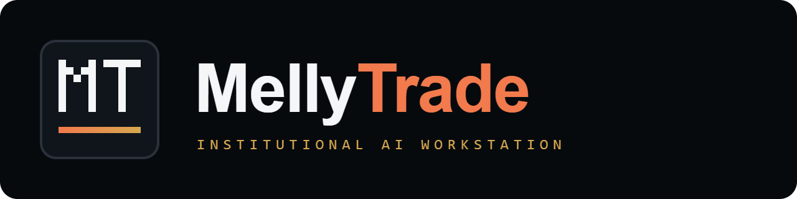
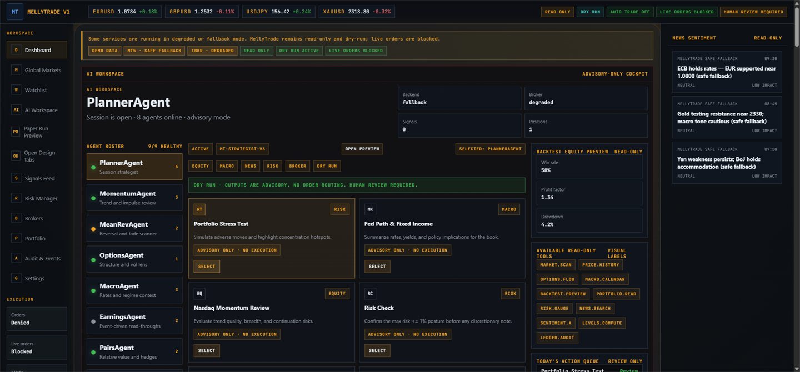

<p align="center">
  
</p>

# MellyTrade

MellyTrade is a safety-first AI trading workstation that demonstrates read-only market analysis, broker status, paper-only planning, and audit-grade risk controls without enabling live execution.

## Live Demo Links

No account, login, API key, or broker credential is required. The hosted surfaces are public demo views and keep the same read-only contract.

| Surface | Link | Purpose |
|---|---|---|
| Main app | [alpha-data-scraper-ai.vercel.app](https://alpha-data-scraper-ai.vercel.app) | Hosted product entry point on Vercel |
| Terminal | [/terminal](https://alpha-data-scraper-ai.vercel.app/terminal) | Institutional dashboard with safety rail, market overview, signals workspace, broker status, and audit feed |
| Mobile/PWA route | [/mobile](https://alpha-data-scraper-ai.vercel.app/mobile) | Mobile command center with the same read-only posture |
| Broker status | [/brokers](https://alpha-data-scraper-ai.vercel.app/brokers) | Broker cards that expose status only, never execution |
| Backend health | [/api/health](https://alpha-data-scraper-ai.onrender.com/api/health) | Render-hosted FastAPI health response |
| Safety status | [/api/safety/status](https://alpha-data-scraper-ai.onrender.com/api/safety/status) | Machine-readable safety posture |
| Desktop shell | [`frontend/src-tauri/`](frontend/src-tauri/) | Tauri thin shell around the same hosted product |

## Product Screenshot



## What The Project Proves

MellyTrade is designed as a credible engineering case study, not a trading signal service. It proves that a fintech-style AI interface can be useful while remaining deliberately constrained:

- AI-assisted market and signal reasoning with human review framing.
- Portfolio, risk, audit, broker, and market overview surfaces in one terminal shell.
- Paper-only planning and preview flows with explicit stop-loss, take-profit, and risk-cap checks.
- GET-only terminal and broker clients for public demo surfaces.
- Degraded-state handling for optional services instead of hiding missing credentials behind broken UI.
- Evidence-driven quality gates using pytest, OpenAPI path checks, Playwright, Docker, and GitHub Actions.
- A multi-surface product shape: hosted web app, mobile/PWA route, FastAPI backend, and Tauri desktop wrapper.

The interesting engineering choice is restraint. The repository keeps AI, broker, and research concepts visible, but public demo surfaces are designed around observability, review, and safety evidence rather than execution.

## Safety Contract

The repository defaults and public demo posture are intentionally restrictive:

```text
autotrade=false
dry_run=true
read_only=true
live_orders_blocked=true
execution_enabled=false
max_risk_per_trade_pct <= 1.0
```

There are no Buy, Sell, Execute, Place Order, connect-live, or live broker execution controls in the public demo. Broker surfaces are status/read-only views. Paper and simulation modules continue to require protective levels such as stop loss and take profit, and safety tests fail if forbidden order-like paths appear in the registered FastAPI routes or OpenAPI schema.

The safety contract is enforced in several places: `config.json`, Pydantic response models, backend route tests, OpenAPI scans, frontend static checks, and visible UI badges. This project is not financial advice and does not make profit claims.

## Architecture

```text
React + TypeScript + Vite web app
        |
        | GET-only public terminal clients
        v
FastAPI backend on Render
        |
        +-- safety status and audit events
        +-- read-only broker status adapters
        +-- paper-only planning and preview services
        +-- typed Pydantic response contracts

Tauri thin shell -> hosted frontend
Mobile/PWA route -> same safety model
```

Core implementation areas:

- `app/main.py` and `app/api/routes/` for the FastAPI application.
- `frontend/src/` for the web terminal, mobile route, and public demo UI.
- `frontend/src-tauri/` for the desktop thin shell.
- `tests/app/test_safety_invariants.py` and `tests/app/test_openapi_forbidden_paths.py` for safety regression coverage.
- `.github/workflows/` for CI, frontend e2e, Docker, and security scanning.

## Verified Engineering Evidence

The repo includes safety and quality evidence that reviewers can inspect directly:

- Pytest safety invariants assert `autotrade=false`, `dry_run=true`, read-only terminal routes, no order-placement paths, and max risk at or below 1%.
- OpenAPI forbidden-path tests scan the generated schema for live execution and order-placement route shapes.
- Frontend tests and static scans protect Terminal V1 surfaces from mutating API helpers and order-button text.
- Playwright e2e validates frontend flows in browser automation.
- Docker and GitHub Actions workflows keep normal CI checks available.
- Render and Vercel host the backend and frontend demo surfaces.
- A maintenance inventory documents which legacy root modules are active tooling, legacy research, safe to remove, or still require review.

## Tech Stack

| Layer | Technology |
|---|---|
| Backend | Python 3.11+, FastAPI, Pydantic |
| Frontend | React, TypeScript, Vite |
| Desktop | Tauri thin shell |
| Mobile | Responsive/PWA route in the same frontend app |
| Tests | pytest safety invariants, OpenAPI forbidden-path tests, Playwright |
| Delivery | Docker, GitHub Actions, Render, Vercel |

## Local Quick Start

Backend:

```powershell
py -3.11 -m venv .venv
.\.venv\Scripts\Activate.ps1
py -3.11 -m pip install -r requirements-ci.txt
py -3.11 scripts/validate_safety_config.py
py -3.11 -m pytest tests/app/test_safety_invariants.py tests/app/test_openapi_forbidden_paths.py -q
```

Frontend:

```powershell
cd frontend
npm ci
npm run build
npm run test:e2e
```

Run locally when dependencies are installed:

```powershell
py -3.11 -m uvicorn app.main:app --reload
cd frontend
npm run dev
```


## Reviewer Map

For a fast technical review, start with the hosted Terminal, then inspect the safety tests and API routes. The public product boundary is intentionally small: `app/` exposes the backend contract, `frontend/src/` renders the web and mobile experience, and `frontend/src-tauri/` wraps the same hosted app for desktop. The older root-level Python modules are documented separately because they are useful for local research history but should not be confused with the public read-only demo.

The most important implementation pattern is explicit denial. Instead of hiding execution behind disabled buttons, the demo avoids public order controls entirely, exposes read-only state, and returns blocked or preview-only responses for paper planning flows. That makes the repository easier to audit: reviewers can search for route methods, OpenAPI paths, safety literals, and forbidden button labels.

## Public Demo Scope

In scope:

- Displaying market, broker, portfolio, signal, and audit state.
- Paper-only planning previews that require protective risk inputs.
- Local test and smoke evidence for read-only behavior.
- Hosted web, backend, mobile route, and Tauri thin-shell delivery.

Out of scope:

- Live broker credentials in the repository.
- Automated order placement.
- Generated trading-result commits to `main`.
- Any claim that model output should be followed as financial advice.

## Honest Limitations

- This is a public read-only demo and local research workstation, not a live trading product.
- Legacy root-level research modules still exist for CLI/backtest/MT5-oriented exploration; they are not the public demo boundary.
- Optional integrations such as broker APIs, AI providers, and hosted services degrade when credentials are absent.
- Real-money execution is intentionally out of scope for this repository posture.
- Some legacy documentation remains broader than the public demo and should be reviewed before using it as operational guidance.
- Hosted demo availability depends on external providers such as Render and Vercel.

## Detailed Documentation Links

- [Root module inventory](docs/maintenance/root_module_inventory.md)
- [Terminal V1 local demo](docs/demo/terminal_v1_local_demo.md)
- [Local read-only demo smoke report](docs/demo/local_readonly_demo_smoke.md)
- [Alpaca paper order draft task](docs/tasks/alpaca_paper_order_draft_001.md)
- [MellyTrade MCP tools](docs/mcp/mellytrade_mcp_tools.md)
- [PR workflow SOP](docs/dev/pr_workflow_sop.md)
- [Safety validator](scripts/validate_safety_config.py)
- [OpenAPI forbidden-path tests](tests/app/test_openapi_forbidden_paths.py)
- [Safety invariant tests](tests/app/test_safety_invariants.py)
