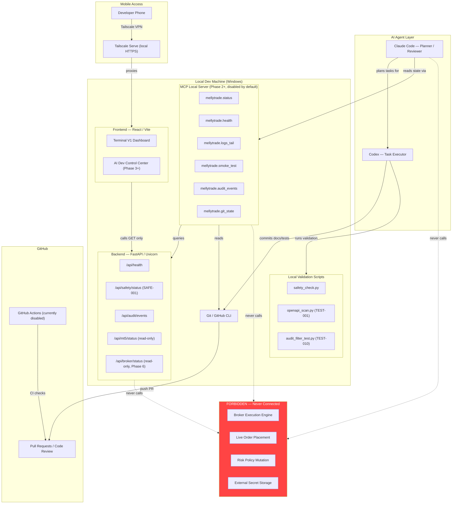
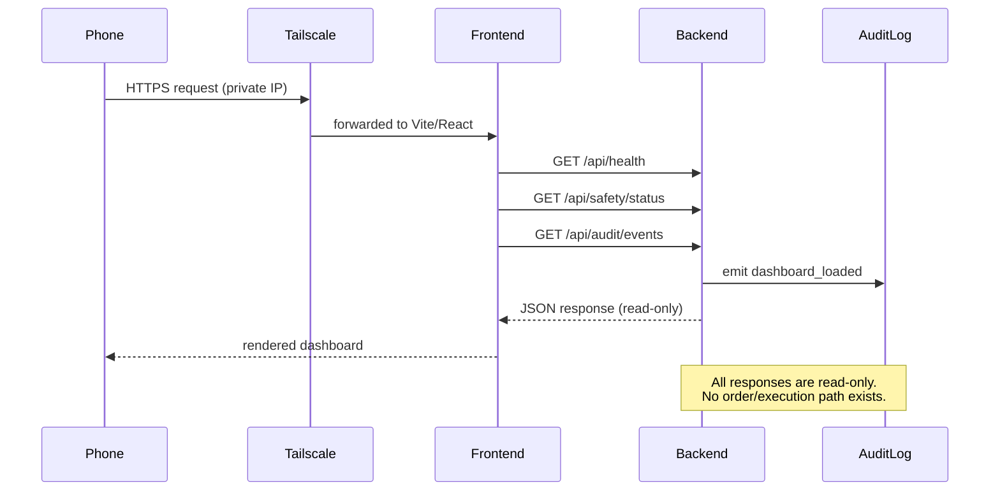
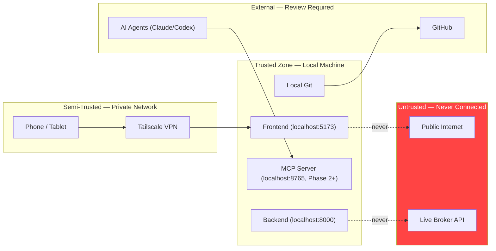

# Safe Full Auto AI Dev System — Architecture

**Version:** 1.0.0
**Branch:** docs/full-auto-ai-dev-system
**Status:** Planning / Docs-only
**Last updated:** 2026-05-09
**Safety class:** DEV-AUTOMATION — read-only, no execution

---

## 1. Why This System Exists

MellyTrade is a quantitative research and dry-run simulation platform. As the codebase grows, development tasks — running validations, checking repo health, monitoring backend/frontend status, planning AI-assisted work — become harder to coordinate manually.

The **Safe Full Auto AI Dev System** provides a structured, automated, and AI-assisted development environment that:

- Lets developers (and AI agents like Claude Code / Codex) understand the state of the repo, services, and safety posture at any moment
- Coordinates local validation, observability, and task orchestration without requiring a human at the keyboard for every step
- Enables safe mobile visibility via Tailscale private networking
- Creates a clear audit trail of every automated action

**This system helps develop and observe MellyTrade. It must never autonomously trade.**

---

## 2. System Overview

The Safe Full Auto AI Dev System is composed of six distinct, non-overlapping subsystems:

| Subsystem | Purpose | Touches Execution? |
|---|---|---|
| **Dev Automation** | AI-orchestrated task planning, branch management, local validation | No |
| **Observability** | Backend/frontend health, audit feed, smoke tests | No |
| **AI Orchestration** | Claude Code planner, Codex executor, MCP tool layer | No |
| **Mobile Access** | Tailscale private network, dashboard from phone | No |
| **Repo/PR Audit** | GitHub PR stack, branch state, CI status | No |
| **Broker Abstraction** *(Phase 6+)* | Read-only broker status display, paper-only | No |

**Broker systems, live order routing, and execution logic are explicitly outside this system's scope.**

---

## 3. Architecture Map



---

## 4. Role Definitions

### 4.1 Claude Code — Planner / Reviewer

- Reads repo state, health endpoints, audit logs via MCP tools
- Plans and reviews tasks; produces structured Codex task definitions
- Reviews PRs, validates docs, checks safety posture
- **Never executes code that touches live trading**
- **Never commits to main directly**
- **Never pushes without explicit human approval**

### 4.2 Codex — Task Executor

- Receives bounded task definitions from Claude Code or human
- Executes within allowed file scopes (docs, tests, validation scripts)
- Creates branches; local commits only; does not push without human review
- **Never modifies execution logic, risk policy, or broker code without explicit human gating**

### 4.3 MCP Layer — Tool Interface (Phase 2+)

- Provides structured, typed, read-only tools for AI agents to query system state
- Disabled by default; started manually on localhost only
- No write tools exist in this layer
- All tool calls are audit-logged
- Tailscale-only external access; never public internet

### 4.4 Dashboard — AI Dev Control Center (Phase 3+)

- React frontend panel showing dev system state
- Reads from backend GET-only endpoints
- No buttons that trigger execution, trading, or order placement
- Safe for mobile viewing over Tailscale

### 4.5 Tailscale — Mobile/Private Access

- Provides encrypted private tunnel from phone to dev machine
- No public internet exposure
- Dashboard accessible from phone without VPN subscription requirement
- Tailscale Serve used for HTTPS access to localhost

---

## 5. Backend/Frontend Observability Flow



---

## 6. Read-Only Safety Guarantees

The following guarantees are enforced at every layer:

| Layer | Guarantee | Enforcement |
|---|---|---|
| Backend routes | GET-only for all display endpoints | FastAPI router, no POST/PUT/DELETE for state-mutating ops |
| MCP tools | No write/execute tools registered | Tool registry validation script (Phase 2) |
| Frontend | No order/trade buttons rendered | Component review; no onClick → trade path |
| AI agents | Cannot call forbidden tool names | Tool allowlist in MCP config |
| Git | Commits are local-only until human reviews | No push step in automation |
| Broker layer | Read-only adapter interface (Phase 6) | BrokerAdapter protocol: get_status() only |

**Hard-coded safety flags (never changed by automation):**

```
autotrade=false
dry_run=true
read_only=true
live_orders_blocked=true
max_risk_pct=0.01  (1%)
```

---

## 7. Forbidden Actions

The following actions are **explicitly forbidden** in this system and must never be implemented, triggered, or implied:

- Enable live trading
- Place, cancel, or modify live orders
- Execute broker API calls that change account state
- Expose or commit secrets (API keys, passwords, tokens with real values)
- Raise max risk above 1%
- Remove stop-loss or take-profit requirements
- Remove cooldown logic
- Bypass safety gates
- Modify `autotrade`, `dry_run`, or `read_only` flags
- Push to `main` without explicit human approval
- Rebase, merge, or force-push without explicit human instruction
- Edit workflow YAML files without explicit human instruction

---

## 8. Trust Boundaries



**Key trust rules:**
- MCP server binds to `127.0.0.1` only (or Tailscale subnet)
- Backend never initiates outbound calls to broker execution endpoints
- AI agents authenticate to MCP with a local secret; no internet-routable credentials
- GitHub is external: PRs require human review before merge

---

## 9. Local-Only Assumptions

This system is designed for a **single-developer local workstation** (Windows 11):

- All services run on `localhost`
- Tailscale provides mobile access without port-forwarding
- No cloud deployment of the dev control plane
- No external database; SQLite or in-memory audit log for Phase 0-3
- GitHub Actions may be disabled at account level; local validation substitutes
- All AI agent interactions are single-session; no persistent agent processes

---

## 10. How This Connects to Terminal V1

Terminal V1 (merged in PR #55) is the production read-only trading dashboard:

| Terminal V1 | Safe Full Auto AI Dev System |
|---|---|
| Shows dry-run trade journal | Shows dev/repo/health state |
| Displays safety posture | Displays AI agent status |
| Read-only display of MT5 data | Read-only display of backend/git/MCP state |
| Portfolio-facing | Developer-facing |
| `main` branch | Planned in `docs/full-auto-ai-dev-system` |

The AI Dev Control Center (Phase 3+) will be a **separate dashboard panel** from Terminal V1, not a replacement. Both coexist in the frontend as different routes.

Proposed routing:
```
/              → Terminal V1 (trading dashboard)
/dev           → AI Dev Control Center (dev system dashboard)
/dev/audit     → Audit feed
/dev/mcp       → MCP health
/dev/git       → Repo state
```

---

## 11. Future Expansion Strategy

| Phase | Capability | Safe? |
|---|---|---|
| Phase 0 | Docs + safety alignment | Yes |
| Phase 1 | Local validation scripts | Yes |
| Phase 2 | MCP read-only skeleton | Yes |
| Phase 3 | AI Dev Control Center planning | Yes |
| Phase 4 | Dashboard read-only shell | Yes |
| Phase 5 | Tailscale/mobile access docs | Yes |
| Phase 6 | Broker abstraction (read-only paper) | Yes (read-only) |
| Phase 7 | IBKR read-only paper adapter | Yes (read-only) |
| Phase 8 | Observability polish | Yes |
| Phase 9 | Quant Research Lab *(future)* | TBD |

Phases 6-7 introduce broker connectivity **strictly** through a `SafeDisconnectedBrokerAdapter` that returns mocked/paper data. No live broker execution path is created in any phase.

---

## 12. System Separation Summary

```
┌─────────────────────────────────────────────────────┐
│  TRADING SYSTEM (existing, untouched by this plan)  │
│  dry_run=true  autotrade=false  live_orders_blocked │
└─────────────────────────────────────────────────────┘
                        ▲ reads status only
┌─────────────────────────────────────────────────────┐
│  DEV AUTOMATION SYSTEM  (this plan)                 │
│  Claude Code + Codex + validation scripts + git     │
└─────────────────────────────────────────────────────┘
                        ▲ queries
┌─────────────────────────────────────────────────────┐
│  OBSERVABILITY SYSTEM  (this plan)                  │
│  Backend health endpoints + audit feed + smoke tests│
└─────────────────────────────────────────────────────┘
                        ▲ visible via
┌─────────────────────────────────────────────────────┐
│  MOBILE ACCESS SYSTEM  (Phase 5)                    │
│  Tailscale private VPN + dashboard on phone         │
└─────────────────────────────────────────────────────┘

┌─────────────────────────────────────────────────────┐
│  BROKER SYSTEMS  (Phase 6+, read-only paper)        │
│  BrokerAdapter protocol — get_status() only         │
└─────────────────────────────────────────────────────┘

┌─────────────────────────────────────────────────────┐
│  AI ORCHESTRATION SYSTEM  (this plan)               │
│  MCP tool layer (Phase 2+) + Claude + Codex         │
└─────────────────────────────────────────────────────┘
```

**None of these systems connect to a live broker execution path. All trading-related state is read-only display of dry-run / paper data.**
