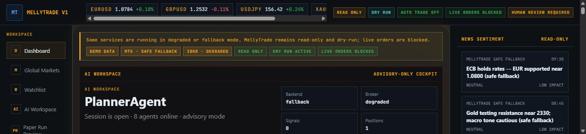
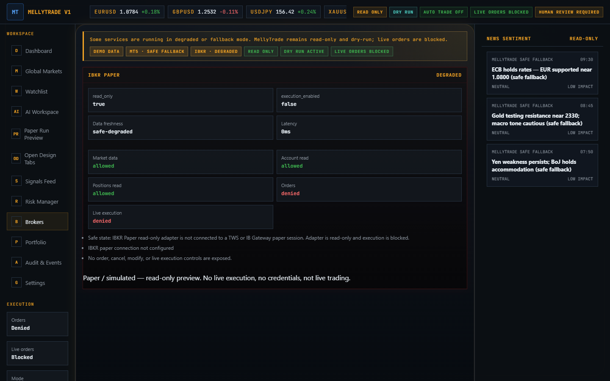
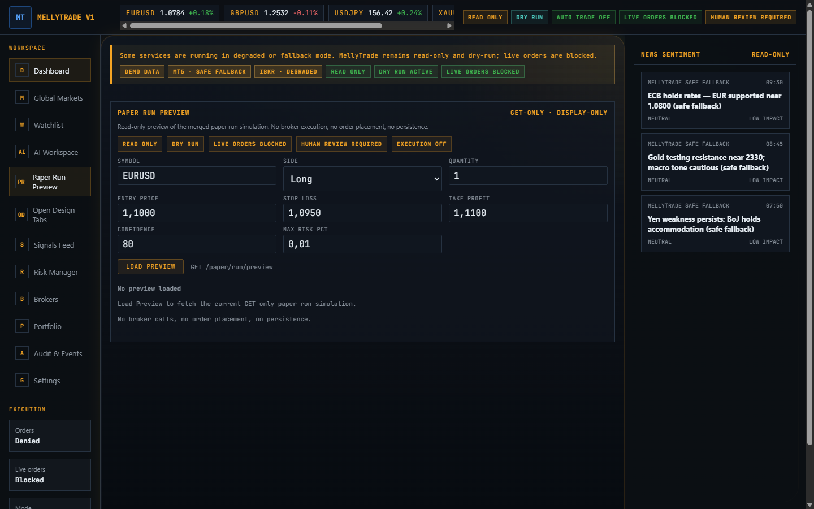

# Broker-Sim Demo — Portfolio Summary

SOURCE STATUS: Public-safe, docs-only portfolio summary. No secrets, no
credentials, no account IDs. Describes a **read-only, simulated / paper** broker
preview. Not live trading, not financial advice.

> **Plain English:** I built and documented a *read-only simulated broker
> preview* for MellyTrade — a FastAPI + React trading **terminal**. It shows
> broker / account / position / order information from demo data, with the whole
> system locked to read-only and dry-run. It never connects to a real broker,
> never uses credentials, and never places an order.

## 1. Overview

MellyTrade is a read-only, dry-run, paper-only portfolio project. The
**broker-sim milestone** took it from "we have scattered read-only endpoints" to
"there is a safe, documented, demoable simulated broker preview" — without adding
any live execution surface.

The work shipped as six small, reviewed PRs (#302–#307), each docs-/test-/UI-
only and gated by CI plus a safety-config validator.

## 2. What was built

| PR | Deliverable |
|---|---|
| [#302](https://github.com/Melly-999/alpha_data_scraper_ai/pull/302) | **Readiness audit** — inventoried backend/API, frontend, docs, tests; classified readiness (see [readiness audit](../tasks/broker_sim_readiness_audit_001.md)) |
| [#303](https://github.com/Melly-999/alpha_data_scraper_ai/pull/303) | **GET-only smoke script** + evidence — `scripts/broker_sim_readonly_smoke.ps1` ([smoke doc](../tasks/broker_sim_readonly_smoke_001.md)) |
| [#304](https://github.com/Melly-999/alpha_data_scraper_ai/pull/304) | **Demo walkthrough** — presenter guide + talk tracks ([walkthrough](../tasks/broker_sim_walkthrough_001.md)) |
| [#305](https://github.com/Melly-999/alpha_data_scraper_ai/pull/305) | **Milestone closeout** — single source of truth ([closeout](../tasks/broker_sim_milestone_closeout_001.md)) |
| [#306](https://github.com/Melly-999/alpha_data_scraper_ai/pull/306) | **UI label polish** — clearer "paper / simulated / read-only" messaging ([UI polish](../tasks/paper_sim_ui_polish_001.md)) |
| [#307](https://github.com/Melly-999/alpha_data_scraper_ai/pull/307) | **Screenshot evidence** — public-safe demo screenshots ([evidence](../tasks/broker_sim_screenshot_evidence_001.md)) |

**Readiness classification: B — READY FOR INTERNAL SIMULATED BROKER PREVIEW.**

## 3. Safety-first design

The safety posture is enforced in config, asserted by a pytest suite, validated
by `scripts/validate_safety_config.py`, and surfaced in the UI:

```text
autotrade=false
dry_run=true
read_only=true
live_orders_blocked=true
execution_enabled=false
max_risk_per_trade <= 1%
no broker execution
no live trading UX
```

The frontend exposes **no** `placeOrder` / `submitOrder` / `cancelOrder` /
`executeTrade` / `enableAutotrade`, and there are **no** Buy / Sell / Order /
Execute controls anywhere.

## 4. Demo proof

The GET-only smoke (`scripts/broker_sim_readonly_smoke.ps1`) drives the read-only
surface and asserts the safety flags + scans responses for forbidden fields.
Recorded local run:

```text
PASS: 47   SAFETY-FAIL: 0   WARN: 0   SKIP: 0
RESULT: PASS -- read-only surface safe
```

It is GET-only (no POST/PUT/PATCH/DELETE), needs no credentials, and exits 0 even
when the backend is offline (documented degraded SKIP).

## 5. Screenshots







(Full inventory and public-safety review: [screenshot evidence](../tasks/broker_sim_screenshot_evidence_001.md).)

## 6. Technical scope

- **Backend:** FastAPI, broad read-only (GET) surface — `/api/safety/status`,
  `/api/brokers/...`, `/api/alpaca-paper/...`, `/api/positions/...`,
  `/api/orders`, `/api/risk/...`, `/api/terminal/...`. Demo/preview services
  back the broker surfaces; no live broker SDK is wired in.
- **Frontend:** React + TypeScript terminal; display-only broker/paper panels
  with safety chips and demo labelling.
- **Tooling:** PowerShell GET-only smoke; Python safety-config validator; CI
  (Bandit SAST, secret scanning, dependency audit, build, tests, Playwright e2e).
- **Process:** small reviewed PRs, each with a review-merge gate (metadata,
  changed-file allow-list, validation, static scan, CI) before squash-merge.

## 7. What this does not do

- Does **not** connect to a real broker or use credentials / broker auth.
- Does **not** place, submit, or cancel orders; **no** trade execution.
- Does **not** show real balances, positions, or orders (demo/fallback data).
- Is **not** production trading-ready and is **not** financial advice.

## 8. What I learned / what this demonstrates

- **Risk-first product thinking:** treat "don't ship an execution surface" as a
  feature, and make safety legible in both the API and the UI.
- **API validation discipline:** a small, dependency-light GET-only smoke that
  proves invariants and scans for sensitive-field leakage.
- **Frontend safety messaging:** unambiguous read-only / simulated labelling so a
  viewer can't mistake demo data for real trading.
- **CI / review discipline:** allow-listed changed files, static scans, and a
  repeatable review-merge gate per PR.
- **Honest scoping:** classifying readiness (B) and explicitly fencing real
  broker integration as a separate, approval-gated effort.

## 9. Recruiter-friendly summary

> Built and documented a read-only simulated broker preview for a FastAPI/React
> fintech terminal. Added a safety audit, a GET-only smoke script, a demo
> walkthrough, UI labelling polish, and public-safe screenshot evidence. The
> milestone demonstrates API validation, frontend safety messaging, CI
> discipline, and risk-first product thinking — all without live broker
> execution.

## 10. Next steps

- Optional: **DEAD-CODE-DASHBOARD-ROUTING-AUDIT-001** — decide on an unrouted
  legacy dashboard component found during the UI-polish task.
- Future only (out of scope, separate explicit approval): real broker
  integration planning.

Related portfolio docs: [case study](mellytrade_case_study.md) ·
[CV entry](mellytrade_cv_project_entry.md) ·
[LinkedIn summary](mellytrade_linkedin_summary.md).

---

*MellyTrade is a read-only, dry-run, paper-only portfolio project. It is not a
commercial platform, not a live trading system, and not financial advice.*
